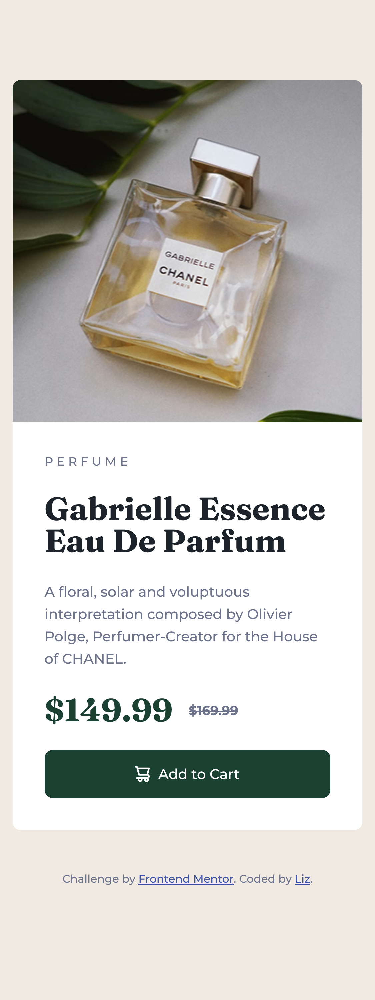
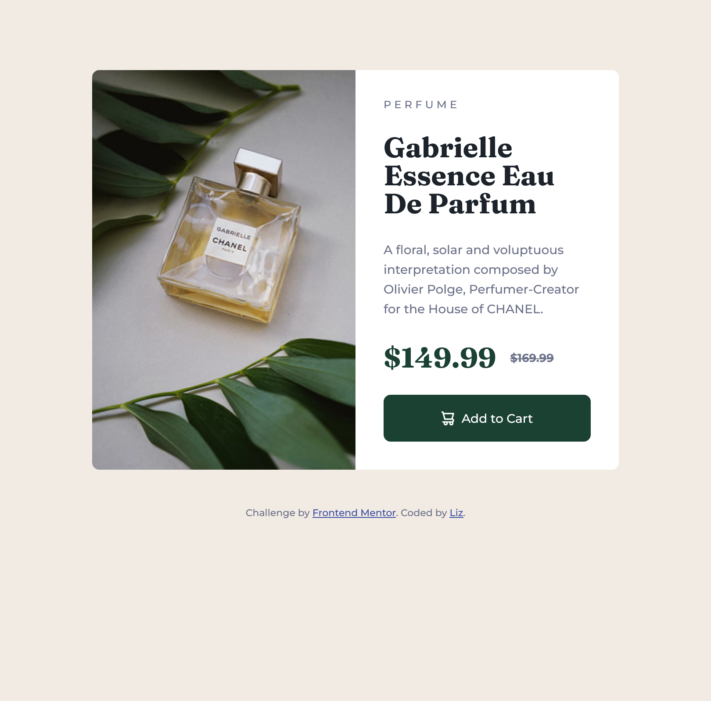
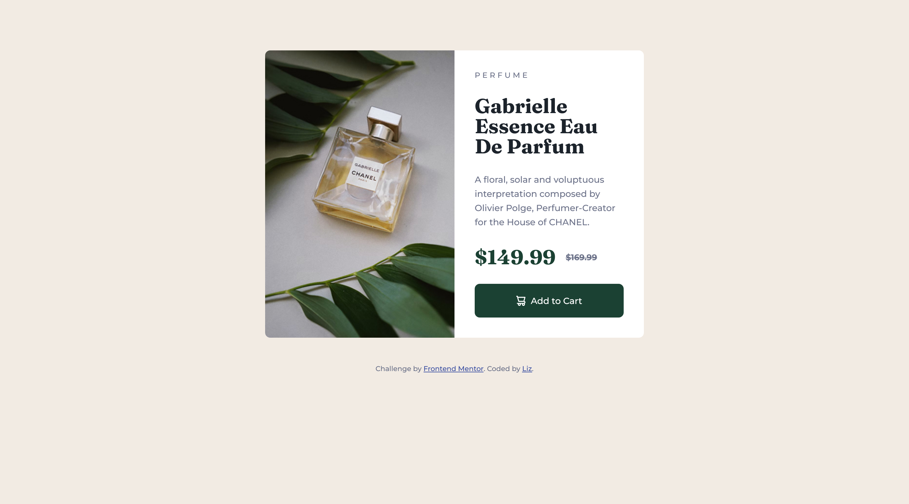

# fem-product-preview-card-component

# Frontend Mentor - Product preview card component solution

This is a solution to the [Product preview card component challenge on Frontend Mentor](https://www.frontendmentor.io/challenges/product-preview-card-component-GO7UmttRfa). Frontend Mentor challenges help you improve your coding skills by building realistic projects.

## Table of contents

- [Overview](#overview)
  - [The challenge](#the-challenge)
  - [Screenshot](#screenshot)
  - [Links](#links)
- [My process](#my-process)
  - [Built with](#built-with)
  - [What I learned](#what-i-learned)
  - [Continued development](#continued-development)
- [Author](#author)

## Overview

### The challenge

Users should be able to:

- View the optimal layout depending on their device's screen size
- See hover and focus states for interactive elements

### Screenshot





### Links

- Solution URL: [Add solution URL here](https://your-solution-url.com)
- Live Site URL: [Add live site URL here](https://your-live-site-url.com)

## My process

### Built with

- Semantic HTML5 markup
- CSS custom properties
- Flexbox
- CSS Grid
- Mobile-first workflow

### What I learned

I'm learned of using <picture> element to allows me to specify different images for different screen sizes.

To see how you can add code snippets, see below:

```html
<picture>
  <source srcset="./img/image-product-desktop.jpg" media="(min-width: 768px)" />
  
</picture>
```

### Continued development

I need to learn more about using Sass/SCSS on my future projects.

## Author

- Website - [Add your name here](https://www.your-site.com)
- Frontend Mentor - [@Coder-Liz](https://www.frontendmentor.io/profile/Coder-Liz)
